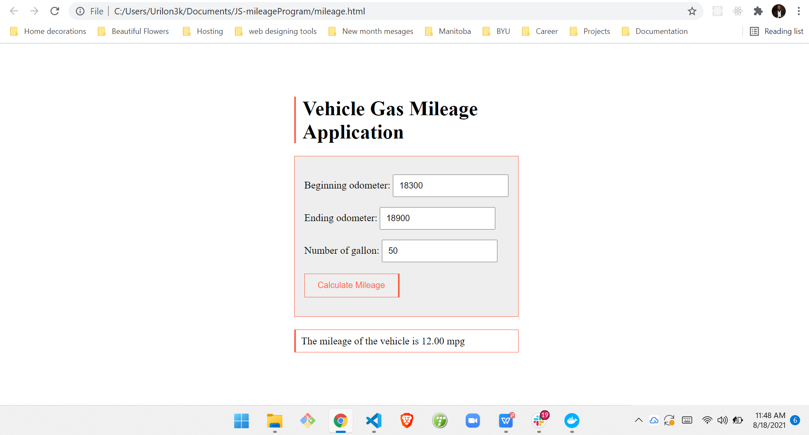

# JS-mileageProgram
<p>
Simple JavaScript program to compute the mileage of a vehicle.The program allow the user to enter the beginning and ending odometer readings and the number of gallons of gasoline used, it then outputs the mileage in miles per gallon. This program  correctly handles real numbers like 8.54.
</p>

## Defining Table

<br>

```javascript
    // Input(s) : Beginning and Ending Odometer, number of gallon
    // Processing : Perfrom arithmetical computation (Ending odometer -  beginning odometer) / gallon
    // Output(s) : Output the mileage of the vehicle
```


## Screenshots

<br>




  

  
## Extras

Feel free to email me anytime with your questions, link in profile page, if you need help understanding the code. 

You may copy or use the code as it pleases you.

Enjoy

&copy; Israel Damilola Akinwumi
  
